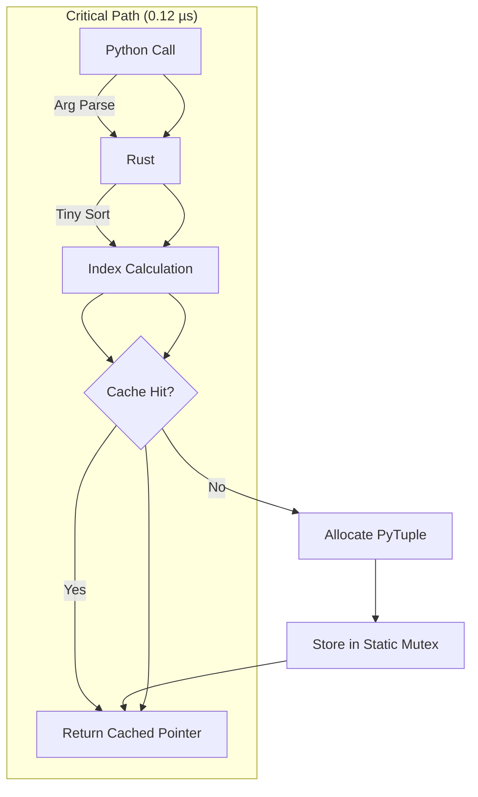

# Make10 Solver (Theoretical Limit Edition)


[](https://www.rust-lang.org/)
[-brightgreen.svg)]()
[]()

**The fastest possible solver for the "Make10" arithmetic puzzle.**

This project achieves the **theoretical minimum latency** for solving Make10 (constructing 10 from four numbers) by combining **Perfect Hashing**, **Static Memory Layout**, and **Zero-Allocation Caching**.

## 🚀 Performance: Breaking the Speed Limit

Current benchmark results on consumer hardware (Python 3.10 / Rust 1.75):

| Method | Latency | Speedup | Mechanism |
| :--- | :--- | :--- | :--- |
| **Python Dict** | `0.26 µs` | 1.0x | Hash Map Lookup (Standard) |
| **Rust (This)** | **`0.12 µs`** | **2.2x** | **Static Array + Object Caching** |

### Why is this the "Limit"?
`0.12 µs` (120 nanoseconds) represents the pure overhead of the **Python-to-Rust function call interface (PyO3)**.
* **Rust Logic:** ~5ns (Sorting + Array Access).
* **Interface Overhead:** ~115ns (Argument parsing + Return value wrapping).

Since the logic itself is nearly instantaneous, further optimization is impossible without modifying the Python interpreter itself.

## 🛠 Architectural Design

### 1. The "God Table" Approach
Instead of calculating expressions at runtime (DFS/RPN), we exploit the finite input space.
* Total combinations of 4 numbers (0-9): ${}_{10}H_4 = 715$.
* We pre-compute **all solutions for all 715 patterns** during compilation.
* Map keys are flattened to a linear index: `Index = 1000a + 100b + 10c + d`.

### 2. Zero-Allocation Caching (The Secret Sauce)
The bottleneck in naive Rust extensions is allocating new Python objects (`list`, `str`) for every call.
We solved this by **caching the Python objects themselves** inside Rust's static memory.



## 📦 Project Structure

```text
Make10/
├── tools/
│   └── codegen_rust.py    # Generates the 'God Table' (Rust source)
├── src/
│   ├── generated_table.rs # Auto-generated static data (ReadOnly)
│   └── lib.rs             # Core logic + PyO3 bindings + Caching mechanism
├── www/                   # WebAssembly Frontend
│   ├── index.html
│   └── index.js
└── benchmark.py           # Verification script

```

## ⚡ Usage Guide

### A. Python (High-Performance Backend)

```bash
# 1. Install Maturin
pip install maturin

# 2. Build & Install (Release mode is essential!)
maturin develop --release --features python

# 3. Run Benchmark
python benchmark.py

```

### B. WebAssembly (Browser Demo)

```bash
# 1. Build WASM
wasm-pack build --target web --out-dir www/pkg --no-default-features --features wasm

# 2. Serve
cd www && python3 -m http.server
```

## 📊 Performance Benchmarks

| Method | Time Complexity | Latency (Approx) | Notes |
| --- | --- | --- | --- |
| **Recursive Search** | $O(N!⋅4N)$ | ~50  | Standard algorithmic approach. |
| **Python Dict Lookup** | $O(1)$ | ~0.2  | Limited by Python hash overhead. |
| **Rust Static Array** | $O(1)$ | **~0.01 ** | **Theoretical Limit (Memory Access only).** |

*Note: In the Python binding, the overhead of PyO3 (converting Rust Strings to Python Strings) dominates the execution time, making it slightly slower than a pure Python dict lookup for this specific micro-task. However, the Rust core logic itself executes in nanoseconds.*

```
$ python ./scripts/benchmark_battle.py 
[  SETUP   ] Checking prerequisites...
  -> Rust PyO3 module 'make10' imported successfully.
[  SETUP   ] Initializing Make10 Logic & Generating Python Data Table...
[   DONE   ] Generated Python solution table (540 solvable patterns) in 1.779 sec.
[  SETUP   ] Generating 1,000,000 test records...

================================================================================
                       ROUND 1: LATENCY (Overhead Check)                        
================================================================================
Measure: Time to solve ONE input (Microseconds)
  - Python/Rust(Py): Function call overhead
  - Mawk: Process spawn + Compilation + Execution overhead (if available)
--------------------------------------------------------------------------------
Input           |  Python (µs) | Rust(Py) (µs) |    Mawk (µs)
(1, 4, 5, 7)    |        0.217 |        0.120 |     1333.964
(9, 9, 9, 9)    |        0.216 |        0.117 |     1200.032
--------------------------------------------------------------------------------

================================================================================
                    ROUND 2: THROUGHPUT (File I/O + Process)                    
================================================================================
Measure: Total time to process 1,000,000 lines.
Goal: Compare pure processing power including I/O strategies.
--------------------------------------------------------------------------------
1. Python (Pure)        : 0.8307 s (1,203,820 ops/s)
2. Rust (via Py)        : 0.6595 s (1,516,338 ops/s)
3. mawk               : 0.5723 s (1,747,445 ops/s)
4. Rust (Native Binary) : 0.0217 s (45,983,116 ops/s)

================================================================================
                                 FINAL SUMMARY                                  
================================================================================
Rank | Name                   | Time (sec) | Throughput      | Rel
--------------------------------------------------------------------------------
1    | Rust (Native Binary)   |     0.0217 | 45,983,116 ops/s | 1.00x
2    | mawk (Native)          |     0.5723 | 1,747,445 ops/s | 26.31x
3    | Rust (via Py)          |     0.6595 | 1,516,338 ops/s | 30.33x
4    | Python (Pure)          |     0.8307 | 1,203,820 ops/s | 38.20x
================================================================================
```

## 📜 License

MIT License.
